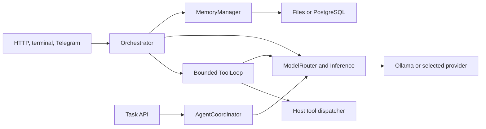

# HyperClaw in the changing Claw ecosystem

**HyperClaw has a tested foundation for a custom local assistant. Its largest gaps are controlled tool execution, durable background work, standard integrations, and retrieval quality.** The broader ecosystem has moved toward assistants that preserve work through interruptions, manage permissions and credentials explicitly, reuse tools across products, and learn reusable procedures. Local model access is increasingly common. The strategic opportunity for HyperClaw is a dependable, inspectable assistant for specific workflows; competing across every channel, device, and plugin would require substantially more work.

This assessment compares HyperClaw commit `ad32fa263cc105b4a095ddf5ff6f10a7bd7303e8` with primary sources available on September 9, 2026. The latest stable OpenClaw release observed was **v2026.9.3**, published September 8 at 14:15 UTC. Alternative-project documentation is identified separately from release evidence because a default branch can contain newer features. HyperClaw's test results are retained observations from the preceding development work; the other runtimes have not been benchmarked against it on the same machine.[^1], [^2]

The practical recommendation is to preserve the consolidated Python/Ollama core while evaluating OpenClaw as a reference platform. First strengthen execution boundaries and task recovery, then add one useful MCP integration and measure memory quality. If the primary objective is a broad everyday assistant across messaging, browsers, and devices, conduct a small OpenClaw adoption trial before funding equivalent features in HyperClaw. These are different investment choices, and the existing code makes it possible to compare them without discarding current work.

**The recent changes are architectural, not just a longer model list.** The following dates are publication dates where available; OpenClaw's version labels do not always correspond to their publication day. Its 2.0 announcement appeared August 30, while the GitHub stable release was published August 31 UTC.[^3]

| Period or release | Documented change | Implication for HyperClaw |
| --- | --- | --- |
| January 30, 2026 | The project adopted the OpenClaw name after its earlier Clawdbot/Moltbot identities. | Older names often refer to the same upstream lineage; alternative projects need separate provenance checks.[^4] |
| v2026.7.1, July 13 | Durable activity audit, stronger credential handling, scoped automation, and checks on community skill/plugin releases. | Auditing, ownership, and extension trust became visible parts of the product contract.[^5] |
| v2026.8.1 / OpenClaw 2.0, August 31 UTC | Rebuilt browser workspace; sessions and transcripts moved into SQLite; integrated memory, skills, automation, and device workflows. | Conversation persistence now sits inside a much broader operational platform. Storage migrations and downgrade behavior are part of maintaining that platform.[^3], [^6] |
| v2026.9.1, September 3 | More guarded setup/update behavior, conversation reconciliation, and visible recovery states. | Successful installation is only one stage; existing state must remain usable during failure and repair.[^7] |
| v2026.9.2, September 5 | Hardware-aware local setup verifies a response and an actual file-read tool result; eligible interrupted work gains recovery improvements. | A model that answers a greeting has not yet demonstrated that it can operate the assistant.[^8] |
| v2026.9.3, September 8 | Candidate updates are rehearsed before activation; agent-owned skill collections persist across workspaces; browser and session workflows expand. | Upgrades, reusable procedures, and recoverable execution are continuing priorities.[^1], [^9] |

The release cadence creates real compatibility costs. Version 9.3 changes Node requirements and several execution-policy and approval SDK interfaces. Its maintenance documentation distinguishes a recovered old installation from a successful update, and describes independent validation before activating an automatically repaired candidate. Those are useful patterns for HyperClaw's future installer and migrations, even if reproducing the entire updater would be premature.[^1], [^9]

The evidence also contains an instructive supersession. Version 9.2's release notes describe applying lean tools during managed local setup. The tagged 9.3 documentation says setup no longer enables that flag: local routes normally defer schemas through Tool Search while retaining authorized capabilities. Explicit lean mode removes optional capabilities. A configuration copied from an earlier release summary can therefore produce a materially different assistant. Both the historical note and the newer tagged source support this distinction.[^8], [^10], [^11]

**The current HyperClaw runtime is smaller and more coherent than the repository's full module inventory suggests.** HTTP, terminal, and canonical Telegram chat share an orchestrator and provider transport. Conversations and explicit memories have durable file storage, with PostgreSQL available for the corresponding persistence paths. Coordinated tasks use the shared model router, but their execution path is narrower than interactive tool use.[^2]

The diagram describes the consolidated paths. Separate research, Nexus, recursive, civilization, connector, and routing modules require their own assessment. A class, tool schema, or module name is evidence that code exists; it does not demonstrate that the active assistant uses it or that an external service works.

| Capability | HyperClaw at the inspected revision | Comparison assessment |
| --- | --- | --- |
| Local inference | Real `qwen3.8:27b-mlx` checks cover text, streaming, tools, images, and usage. Explicit Ollama selection keeps canonical model fallback within Ollama. | A demonstrated strength for this installation. It is not evidence of superior model quality, speed, or broad model compatibility.[^2], [^12] |
| Conversation continuity | Atomic file writes, durable reset, hashed session filenames, optional database transactions, and restart tests. | Strong basic continuity. Process-local caches/locks and retained-history limits constrain scaling; transcript isolation is not tenant authorization.[^2] |
| Long-term recall | Explicit memories persist. Active local search uses query-word substrings; database fallback uses `ILIKE`; `_get_embedding()` returns `None`. | Behind OpenClaw's documented full-text/hybrid retrieval options. Separate vector modules do not make the active memory manager semantic.[^2], [^13] |
| Tool execution | Offered-name checks, bounded rounds, deadlines, and repeated-call protection. HTTP uses a small core tool set; terminal exposes a static 87-tool catalog. | Useful loop controls. Shell and filesystem tools still operate on the host; a general approval broker and OS sandbox are not wired into this path.[^2] |
| Background tasks | In-memory queue, task records, and execution locks; competing callers share a terminal result. Each specialist task makes one routed model call. | Same-process deduplication is tested. Durable restart recovery, checkpoints, and specialist tool workflows remain gaps.[^2] |
| Scheduling | Five fixed APScheduler jobs; no persistent job store configured. | Earlier-stage than a user-managed automation service with durable run/delivery status.[^2], [^14] |
| Channels and devices | Canonical Telegram has allowlist and webhook-secret controls. HTTP defaults to loopback; additional connectors and browser/desktop modules exist. | A useful local/Telegram base. Native-device experiences and broad channel lifecycle behavior are not demonstrated by the current battery.[^2], [^15] |
| Access control | Caller-selected HTTP session IDs, with no common HTTP authentication layer found. Telegram checks an explicit chat allowlist. | Treat the current HTTP application as a trusted local-operator surface. Sharing it requires an identity and authorization design.[^2] |
| Extensions | Custom JSON skill definitions/proposals and static Python tool dispatch. No native MCP, ACP, or `SKILL.md` loader was found in the inspected implementation. | An important interoperability gap. Names such as “skills” and “subagent” do not imply compatibility with external formats/protocols.[^2], [^16] |
| Learning | Workspace identity/memory files and stored instincts enter system context; custom skill proposals have activation logic. | Ingredients for adaptation exist. There is no demonstrated closed loop proving that newly learned procedures improve later tasks.[^2] |
| Operational evidence | Repeatable test runner, isolated process tests, live-model scenarios, failure reports, and CI configuration. Usage totals are in memory. | A useful verification foundation. Durable production traces, recovery evidence, and broad task-quality evaluations are still limited.[^2], [^17] |

The distinction between memory storage and retrieval is especially important. Explicit memories survive process restart; a separate live-model test returns a stored marker through a tool using a freshly initialized memory manager. Together these establish persistence and information delivery, with different process boundaries. It does not prove recall across paraphrases, corrections, long histories, or changing facts. OpenClaw's builtin engine documents FTS5/BM25, optional embeddings, hybrid retrieval, and provenance metadata; without an embedding provider it also remains keyword-only. Its capability is conditional on configuration, rather than automatic semantic understanding.[^12], [^13]

Likewise, a coordinated task's “completed” status currently records that a model response was obtained. It is not necessarily evidence that a requested external action happened. The task executor's single model call and in-memory state are visible in `AgentCoordinator.execute_task()` and its constructor. For unattended work, the task record should eventually point to an observable result, retain progress across restart, and distinguish failed, cancelled, uncertain, and completed outcomes. This is an architectural recommendation derived from the current implementation.[^2]

**Related projects have differentiated around execution boundaries, deployment, and adaptation.** They should not be treated as interchangeable forks. The stable releases below were checked against official release metadata; feature descriptions also draw on the pinned documentation linked in the alternatives evidence note.[^18]

| Project | Stable release observed | Main documented emphasis | What to examine before adopting |
| --- | --- | --- | --- |
| OpenClaw | v2026.9.3, September 8 | Broad assistant workspace, channel/device integration, memory, skills, and operational recovery. | Configuration and migration cost; plugin stability; actual trust boundary and supported runtime versions.[^1], [^19] |
| NanoClaw | v2.3.0, August 24 | Docker agent environments, session lifecycle, and OneCLI credential separation. Canonical repository is now `nanocoai/nanoclaw`. | Default harness and customization requirements; local-provider alternatives; filesystem sharing within agent groups. Its architecture document is explicitly a draft.[^18], [^20] |
| ZeroClaw | v0.8.5, September 5 | Rust runtime with configurable providers, tools, memory, and execution policy. | Sandbox backend actually selected on the target OS; automatic selection can fall back to none, and outbound networking is a separate policy.[^18], [^21] |
| IronClaw | ironclaw-v1.4.0, published August 28 | Capability-limited WASM extensions, credential controls, and persistent Docker environments in the current release. | Which boundary applies to each tool, container persistence, notification/approval durability, and deployment-specific differences.[^18], [^22] |
| PicoClaw | v0.3.1, July 3 | Compact Go deployment with local-provider, memory, skills, and MCP support. | The project still cautions against production deployment before v1.0; command guards do not recursively inspect child processes.[^18], [^23] |
| Hermes Agent | v0.21.1 / tag v2026.9.7, September 7 | Reusable skills, session recall, learning workflows, and multiple execution backends. | Review gates, profile isolation, and backend behavior. Some deferred learning work is queued only in memory.[^18], [^24] |

NanoClaw's current release has driver boundaries while retaining Docker and SQLite defaults, scheduled-task lifecycle work, and recovery of running sessions after host restart. That makes it a useful reference for a focused runtime even when its default Claude Agent SDK harness is not the desired model stack. Its transferable lesson is the ownership of a session's process, storage, and credentials.[^20]

IronClaw illustrates why “Rust plus WASM” is now an incomplete description. Its current release includes persistent per-user Docker containers, managed egress, and a durable notification inbox, with a different worker approach for its Railway deployment. The current sources do not support a blanket PostgreSQL-only description: v1.4.0 explicitly discusses libSQL. They also show that execution spans WASM tools and Docker environments. ZeroClaw and PicoClaw similarly require inspection of configuration and subprocess boundaries before making security claims.[^21], [^22], [^23]

Hermes is particularly relevant if the desired value is an assistant that becomes better at recurring work. Its memory documentation separates bounded personal memory from searchable session history and describes optional review gates. It also exposes operational limits, including loss of a deferred local-review queue on exit. “Learning” therefore needs to be evaluated as a sequence of stored evidence, proposed changes, review, execution, and measured outcomes.[^24]

There is no defensible speed, RAM, or security ranking in this evidence. A small agent binary excludes the local model's memory, inference server, browser, and containers. Different default models, permissions, and task definitions make headline comparisons unsuitable for choosing this machine's runtime. The relevant comparison is total working-system behavior under the same workload and failure conditions.

**Interoperability offers a way to reuse capabilities while retaining control of the assistant.** MCP, ACP, and A2A solve different problems. None supplies the entire runtime, its memory policy, or its operating-system isolation.[^16]

| Interface | Current status observed | Useful HyperClaw application | Boundary that remains ours |
| --- | --- | --- | --- |
| MCP | Published specification 2026-07-28; Python SDK v2.0.0 supports that revision and earlier revisions. | Consume a selected external tool/resource server without adding another bespoke connector. | Server trust, credentials, authorization, cancellation, bounded results, and execution policy.[^25], [^26] |
| ACP | Stable v1; v2 was announced as draft July 20. | Let an editor drive HyperClaw, or supervise an external coding harness with a defined lifecycle. | Exact client/harness capability support and the harness's own execution permissions.[^27] |
| A2A | Released specification 1.0.0. | Delegate to a separately operated agent service when one is actually needed. | Principal identity, task/artifact access, authorization, and external failure handling.[^28] |
| Agent Skills / plugin bundles | OpenClaw loads `SKILL.md` and maps selected bundle features; native runtime plugins are separate. | Reuse instruction packages with explicit supported features. | Provenance, admission, dependencies, and tool authority; imported text is not permission.[^29] |

MCP's July revision is a meaningful change: protocol-level sessions and the initialization handshake were removed in favor of request metadata and capability discovery. Tasks moved into an extension, and some older features/transports are deprecated. A new adapter should use a maintained SDK and test named older/newer peers. Assuming the wire behavior of a 2025 tutorial would be a poor starting point.[^25]

A narrow MCP client is the best initial interoperability candidate for HyperClaw because it addresses a visible gap without requiring a new assistant runtime. Begin with a single useful, allowlisted server and a synthetic test fixture. Route its calls through an explicit enforcement boundary, preserve tool provenance, and keep connector permissions separate from model-provider selection. Ollama inference remaining local does not imply that an MCP server or another tool remains local.[^16], [^26]

ACP should follow a concrete editor or harness use case. OpenClaw's own ACP compatibility matrix has unsupported features, and its external ACP harnesses run outside the OpenClaw sandbox; the documented policy rejects certain sandboxed spawns. This is evidence that an adapter's supported subset and its execution boundary matter more than a simple “ACP supported” checkbox.[^30]

OpenClaw also documents an MCP conversation bridge that could support coexistence: an external client can read routed conversation activity and use selected reply/approval tools. That is a potential integration seam, not a proven HyperClaw feature. It carries substantial authority and has an in-memory event queue, so it should not be mistaken for a durable message bus.[^31]

**Execution controls are the first practical gap to close before expanding autonomy.** HyperClaw's loop already constrains offered tools, repeated calls, and elapsed time. Its canonical host dispatcher does not consistently mediate actions through HyperShield or an approval system. A timeout can stop the turn while a synchronous tool thread continues running. These are concrete reasons to separate tool planning, authorization, execution, and result recording.[^2]

An initial design should bind permission to the principal, tool, arguments, workspace, and relevant destination. Local reads, file mutations, subprocess execution, and external sends need distinguishable policies. Processes need owned cancellation/cleanup; uncertain side effects need explicit records before any retry. A container or another chosen execution boundary should have a defined filesystem and network policy. These recommendations concern observable behavior and do not assume that every invocation needs a human prompt.

OpenClaw provides a useful caution here: its documented Gateway boundary is one operator or mutually trusting team. Session keys and collaborative role controls are not hostile-user isolation. Native plugins also execute in-process, and all plugin APIs are labelled experimental. Moving to OpenClaw would add mechanisms, but it would still require a deliberate deployment and trust model.[^10], [^19], [^29]

**An agent's environment changes along several independent dimensions.** Beyond changes in the ecosystem, the runtime must cope with revised model behavior, tool schemas, permissions, files, external systems, and learned procedures. HyperClaw currently reloads workspace context and supports durable memory, but it does not demonstrate a comprehensive change-aware learning system. The following is a proposed evaluation framework, not a description of features already implemented.

| Change | Example | Evidence the assistant should retain or refresh |
| --- | --- | --- |
| Model/runtime | A model update changes tool-call formatting or usable context. | Model identity and relevant settings, capability probes, and the same workflow evaluation results before/after. |
| Tools/integrations | A connector removes an argument or changes response structure. | Tool/schema version, bounded validation errors, and a compatibility check before replaying a saved procedure. |
| Workspace | A file moves, an output already exists, or the active checkout changes. | Current paths and artifact state; recheck side-effect preconditions at execution time. |
| Permissions | A credential expires, a user revokes access, or a workspace becomes read-only. | Current authorization and an explicit blocked state; remembered success must not confer future authority. |
| Facts and preferences | An older instruction is corrected or a remembered project detail becomes obsolete. | Source, time, scope, supersession, and a way to retrieve the current fact while explaining historical answers. |
| Learned workflow | A formerly useful procedure starts failing after a dependency update. | Preconditions, supporting successful runs, failure evidence, review state, and a reversible retirement/update path. |

LongMemEval-V2 makes this distinction concrete. Its official benchmark tests memory over agent trajectories, including state tracking, workflow knowledge, environment-specific pitfalls, and invalid premises. The earlier LongMemEval tests extraction, multi-session reasoning, time, changed knowledge, and abstention. These are useful categories for a HyperClaw evaluation set; neither benchmark establishes a score for this repository.[^32], [^33]

OpenClaw's standing-intent design provides another useful example. Event-conditioned instructions have explicit owners, scopes, expiry, cooldown, and fire limits; matching occurs before eligible replies. That separates a future action condition from a fact in memory or a clock-based schedule. HyperClaw's stored “instincts” are currently prompt context, so similar terminology would overstate equivalence without trigger, lifecycle, and outcome behavior.[^2], [^34]

**The existing battery supports targeted development, but its results should be interpreted narrowly.** The retained combined run records **651 passing tests, one existing skip, and eight warnings** on Python 3.11.13. Five live scenarios exercised Ollama 0.33.3 with `qwen3.8:27b-mlx`. The measured five-package rollup covered **33.3% of statements and 24.9% of branches**, or 31.6% combined. A separate full deterministic/database run passed on Python 3.13.5.[^12], [^17]

The live cases establish plumbing and small observable contracts: text, streaming/accounting, session continuity, durable memory-tool delivery, and a simple synthetic image. They do not measure completion rates for research, coding, scheduling, browser work, changing preferences, or repeated learning. Large optional areas remain sparsely covered; the skills and scheduler modules have no measured coverage in that rollup. Passing test counts cannot be compared directly with another project's test count.[^2], [^12]

OpenClaw's personal-agent QA pack is a useful reference because it uses synthetic scenarios for reminders, routing, denial, truthful progress, recovery, and redacted diagnostics. Its documentation expressly separates this product QA from a generic model benchmark. HyperClaw can extend its existing runner with similar outcome categories, maintaining separate deterministic contract tests and repeated real-model evaluations.[^35]

**The next investment should be chosen by the workflow it enables.** The following order is an engineering recommendation; it is not an approved implementation plan or a time estimate.

1. **Make consequential execution reviewable and bounded.** Introduce the tool-dispatch enforcement boundary, action records, and process ownership. Acceptance examples: denied actions never execute; cancellation settles the owned process; retries do not duplicate a recorded effect; failed or uncertain work is reported honestly. Retain a convenient trusted-local profile with explicit authority.

2. **Make background work durable.** Persist task state and transitions; define resumable checkpoints and claim ownership. Give specialists an explicit supported execution contract if they must use tools. Acceptance examples: restart between acceptance and execution, restart after an effect but before status publication, and competing workers. Verify outcomes rather than promising exactly-once external effects.

3. **Add one interoperability seam and a useful workflow.** Build a version-tested MCP adapter around one server. Keep the integration replaceable and ensure unsupported capabilities are visible. For example, read a synthetic project dataset and produce a sourced artifact. For a local server, verify its configured filesystem and network isolation; for a remote server, verify resource authorization and the data HyperClaw transmits. Add ACP only if an identified editor or harness is part of the intended experience.

4. **Improve memory from measured failures.** Strengthen lexical retrieval, consistently apply existing timestamp/source/scope metadata, and add correction handling. Evaluate optional local embeddings with hybrid retrieval against the same cases. Include paraphrase recall, contradictory updates, temporal questions, missing-answer abstention, and cross-session access tests. Keep canonical data exportable and indexes rebuildable.

5. **Evaluate adaptation and operating cost.** Compare direct tool exposure with deferred discovery on the same Qwen setup. Measure task completion, invalid calls, prompt size, elapsed time, and operator interventions. Add reviewed procedure proposals only when repeated tasks provide enough evidence to judge whether those proposals help.

This sequence makes sense for a custom local assistant. For a broad personal-assistant product, OpenClaw's existing channels, devices, and workspace may have greater immediate value. A controlled adoption trial should compare HyperClaw and OpenClaw on a shared set of tasks before choosing a migration, coexistence, or continued custom-development path. Hermes is a relevant third candidate if reviewed skill learning is the central requirement; the other alternatives should enter only when their execution or deployment choices solve a specific need.

| Decision test | Success criterion | Why it changes the investment decision |
| --- | --- | --- |
| Recover an interrupted task | Accepted work remains inspectable and resumes or reports a specific terminal/uncertain state. | Tests the largest gap between interactive chat and unattended operation. |
| Recall a corrected project fact | Uses the latest scoped fact, can cite its origin, and abstains when evidence is absent. | Separates durable storage from useful long-term memory. |
| Complete one constrained tool workflow | Produces an inspectable artifact within allowed filesystem/network scope. | Measures useful execution under the intended permissions. |
| Survive a provider or tool change | Fails clearly or adapts through validated capabilities without crossing the local-provider policy. | Tests resilience to the changing environment. |
| Operate for repeated sessions | Records failures, interventions, latency, and resource use under fixed conditions. | Supplies evidence for maintenance cost and everyday usability. |

Use synthetic accounts/data and identical hardware, model configuration where supported, task inputs, and allowed tools. Report unsupported combinations instead of quietly switching to a stronger cloud model. Preserve traces and artifacts, separate cold-start from warm behavior, and repeat model-driven cases enough to report variation. The outcome should decide whether HyperClaw's customization advantage outweighs the cost of rebuilding capabilities already available elsewhere.

The present evidence supports retaining HyperClaw as a focused, modifiable local runtime while making its limits explicit. A broad-platform comparison currently favors OpenClaw's documented feature coverage; a reliability, performance, or task-quality winner remains unmeasured. The most valuable next step is a small set of real workflow comparisons coupled with the execution and durability improvements needed to make those comparisons safe and informative.

Sources are numbered below. Official release dates and specification revisions are distinguished from rolling documentation retrieved September 9, 2026. Repository evidence refers to HyperClaw `ad32fa2`; alternative-file commit IDs are retained in the supporting evidence note. The local evidence note also contains exact code line references, and the protocol note records additional compatibility and authorization details.

[^1]: OpenClaw, [v2026.9.3 release](https://github.com/openclaw/openclaw/releases/tag/v2026.9.3), published September 8, 2026, 14:15:53 UTC. Release status/date checked against GitHub's official release API.
[^2]: HyperClaw, [implementation evidence](2026-09-09-claw-local-evidence.md), inspected September 9, 2026. Exact source references include [MemoryManager](../../hyperclaw/memory_manager.py), [AgentCoordinator](../../hyperclaw/agent_coordinator.py), [ToolLoop](../../hyperclaw/tool_loop.py), [Orchestrator](../../hyperclaw/orchestrator.py), and [server](../../hyperclaw/server.py).
[^3]: Hannes Rudolph, [OpenClaw 2.0, Accidentally](https://openclaw.ai/blog/openclaw-2-accidentally), August 30, 2026; OpenClaw [v2026.8.1 release](https://github.com/openclaw/openclaw/releases/tag/v2026.8.1), published August 31 UTC; [release overview](https://docs.openclaw.ai/releases/2026.8.1).
[^4]: OpenClaw, [OpenClaw lore](https://docs.openclaw.ai/start/lore), rolling documentation retrieved September 9, 2026; names January 30 as the rename date.
[^5]: OpenClaw, [v2026.7.1 notes](https://docs.openclaw.ai/releases/2026.7.1), especially Accounts, devices, and private data; [release](https://github.com/openclaw/openclaw/releases/tag/v2026.7.1), published July 13, 2026.
[^6]: OpenClaw, [v2026.8.1: Installation and Onboarding](https://docs.openclaw.ai/releases/2026.8.1/installation-and-onboarding), storage/downgrade warning and setup behavior; retrieved September 9, 2026.
[^7]: OpenClaw, [v2026.9.1 notes](https://docs.openclaw.ai/releases/2026.9.1); stable release published September 3, 2026.
[^8]: OpenClaw, [v2026.9.2 notes](https://docs.openclaw.ai/releases/2026.9.2), local setup and recovery; stable release published September 5, 2026. The lean-mode setup description is historical and superseded by source 10.
[^9]: OpenClaw, [v2026.9.3 documentation](https://docs.openclaw.ai/releases/2026.9.3), Updates and Maintenance and Skills; retrieved September 9, 2026.
[^10]: OpenClaw, [Experimental features at v2026.9.3](https://github.com/openclaw/openclaw/blob/v2026.9.3/docs/concepts/experimental-features.md), inspected through the tagged raw source; [rendered current page](https://docs.openclaw.ai/concepts/experimental-features), retrieved September 9, 2026.
[^11]: OpenClaw, [Tool Search](https://docs.openclaw.ai/tools/tool-search), rolling documentation retrieved September 9, 2026. OpenClaw's experimental surface is distinct from other harnesses' native tools.
[^12]: HyperClaw, [combined battery summary](../../test-results/all-20260909T055330122263Z/summary.json), September 9, 2026 UTC; [live scenarios](../../tests/live/test_ollama.py); [testing guide](../testing.md). Generated reports are ignored local artifacts and are not included in Git history.
[^13]: OpenClaw, [Builtin memory engine](https://docs.openclaw.ai/concepts/memory-builtin) and [v2026.8.1: Memory](https://docs.openclaw.ai/releases/2026.8.1/memory), retrieved September 9, 2026.
[^14]: OpenClaw, [v2026.8.1: Automations and Scheduling](https://docs.openclaw.ai/releases/2026.8.1/automations-and-scheduling), especially separate run/delivery/completion states; retrieved September 9, 2026.
[^15]: OpenClaw, [v2026.8.1: Messaging](https://docs.openclaw.ai/releases/2026.8.1/messaging) and [Browser and Computer Use](https://docs.openclaw.ai/releases/2026.8.1/browser-and-computer-use), retrieved September 9, 2026.
[^16]: [Protocol and execution-boundary evidence](2026-09-09-claw-interoperability-evidence.md), September 9, 2026; primary specifications and implementation references linked throughout.
[^17]: HyperClaw, [coverage JSON](../../test-results/all-20260909T055330122263Z/coverage.json), [Python 3.13 run summary](../../test-results/full-20260909T054638281006Z/summary.json), and [CI configuration](../../.github/workflows/tests.yml). Hosted CI execution was not part of this comparison.
[^18]: [Current alternatives evidence](2026-09-09-claw-alternatives-evidence.md), September 9, 2026. Contains release publication dates and fifteen primary documents with immutable repository-file links.
[^19]: OpenClaw, [Security trust model](https://docs.openclaw.ai/gateway/security/trust-model), rolling documentation retrieved September 9, 2026.
[^20]: NanoClaw, [v2.3.0 release](https://github.com/nanocoai/nanoclaw/releases/tag/v2.3.0), August 24, 2026; [README](https://github.com/nanocoai/nanoclaw/blob/2c754a2234390fcc597273cef6344d99e8ac03d0/README.md); [Architecture (Draft)](https://github.com/nanocoai/nanoclaw/blob/2c754a2234390fcc597273cef6344d99e8ac03d0/docs/architecture.md), inspected September 9.
[^21]: ZeroClaw, [v0.8.5 release](https://github.com/zeroclaw-labs/zeroclaw/releases/tag/v0.8.5), September 5, 2026; [sandboxing documentation](https://github.com/zeroclaw-labs/zeroclaw/blob/96c05632c3edafe6412149e6938aa0806b4d7400/docs/book/src/security/sandboxing.md), inspected September 9.
[^22]: IronClaw, [v1.4.0 release](https://github.com/nearai/ironclaw/releases/tag/ironclaw-v1.4.0), published August 28, 2026 (title labels August 27); [README](https://github.com/nearai/ironclaw/blob/0280dd1a48a4f813f123735b31558c459d1ce032/README.md), inspected September 9.
[^23]: PicoClaw, [v0.3.1 release](https://github.com/sipeed/picoclaw/releases/tag/v0.3.1), July 3, 2026; [README](https://github.com/sipeed/picoclaw/blob/bbf6893ca7afad27f1d00a0f5a45982a549c6ed6/README.md); [configuration guide](https://github.com/sipeed/picoclaw/blob/bbf6893ca7afad27f1d00a0f5a45982a549c6ed6/docs/guides/configuration.md), inspected September 9.
[^24]: Nous Research, [Hermes v0.21.1 release, tag v2026.9.7](https://github.com/NousResearch/hermes-agent/releases/tag/v2026.9.7), September 7, 2026; [persistent-memory documentation](https://github.com/NousResearch/hermes-agent/blob/6f3e630b47e5afb709a7e30738d66f82bdaa2459/website/docs/user-guide/features/memory.md), inspected September 9.
[^25]: Model Context Protocol, [2026-07-28 specification changes](https://modelcontextprotocol.io/specification/2026-07-28/changelog), published revision July 28, 2026; [Python SDK v2.0.0](https://github.com/modelcontextprotocol/python-sdk/releases/tag/v2.0.0), July 28, 2026.
[^26]: Model Context Protocol, [2026-07-28 specification](https://modelcontextprotocol.io/specification/2026-07-28), [authorization](https://modelcontextprotocol.io/specification/2026-07-28/basic/authorization), and [authorization security considerations](https://modelcontextprotocol.io/specification/2026-07-28/basic/authorization/security-considerations).
[^27]: Agent Client Protocol, [v1 overview](https://agentclientprotocol.com/protocol/v1/overview), retrieved September 9, 2026; [ACP v2 draft announcement](https://agentclientprotocol.com/announcements/acp-v2-draft), July 20, 2026.
[^28]: A2A Project, [released specification v1.0.0](https://a2a-protocol.org/v1.0.0/specification/), release status checked September 9, 2026; no publication date asserted.
[^29]: OpenClaw, [Skills](https://docs.openclaw.ai/tools/skills), [plugin formats](https://docs.openclaw.ai/tools/plugin#understand-plugin-formats), and [plugin bundles](https://docs.openclaw.ai/plugins/bundles), rolling documentation retrieved September 9, 2026.
[^30]: OpenClaw, [ACP bridge compatibility matrix](https://docs.openclaw.ai/cli/acp#compatibility-matrix) and [ACP sandbox compatibility](https://docs.openclaw.ai/tools/acp-agents/delivery#sandbox-compatibility), retrieved September 9, 2026.
[^31]: OpenClaw, [MCP conversation bridge](https://docs.openclaw.ai/cli/mcp/serve), retrieved September 9, 2026.
[^32]: Di Wu and collaborators, [LongMemEval-V2 official repository](https://github.com/xiaowu0162/LongMemEval-V2), retrieved September 9, 2026; agent-environment memory evaluation, with an August 2026 update noted by the repository.
[^33]: Di Wu et al., [LongMemEval: Benchmarking Chat Assistants on Long-Term Interactive Memory](https://arxiv.org/abs/2410.10813), first posted October 14, 2024, accepted ICLR 2025; [official repository](https://github.com/xiaowu0162/LongMemEval), including subsequent dataset updates.
[^34]: OpenClaw, [Standing intents](https://docs.openclaw.ai/concepts/standing-intents), rolling documentation retrieved September 9, 2026.
[^35]: OpenClaw, [Personal agent benchmark pack](https://docs.openclaw.ai/concepts/personal-agent-benchmark-pack), rolling documentation retrieved September 9, 2026.
